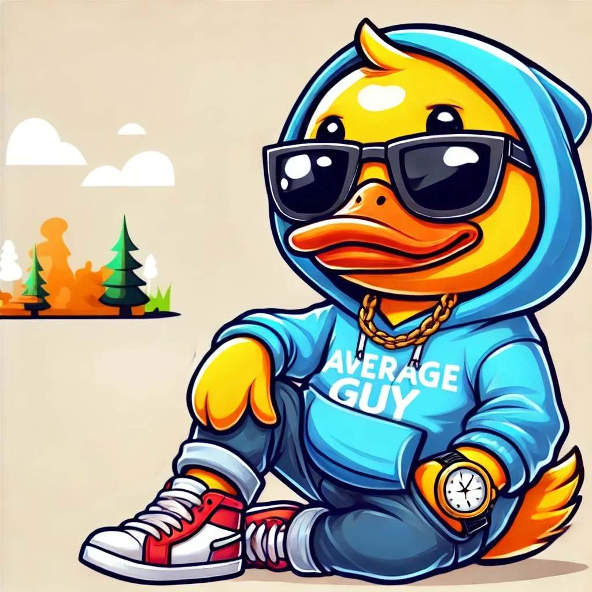

# CHILLQUACK

<figure><figcaption>
Mr. CHILLQUACK
</figcaption></figure>

## Abstract

**$CHILLQUACK** is a decentralized, **meme utility token** built on the Solana blockchain. It transforms the humor and playfulness of memes into a practical tool for real-world utility, creating an ecosystem that is innovative, collaborative, and driven by its community. By integrating AI technology, CHILLQUACK combines fun with meaningful purpose, empowering users to engage and contribute.

At its core, CHILLQUACK uses an autonomous AI agent to optimize trading activities. This ensures liquidity, supports sustainable growth, and aligns with its deflationary tokenomics model designed for transparency, fairness, and security. These principles provide users with confidence in the token’s utility and long-term value.

What sets CHILLQUACK apart is its commitment to its community. Every token holder has a voice in shaping the ecosystem through AI-enhanced governance tools. This combination of advanced technology and active participation creates a dynamic space for collaboration and innovation.

Whether you are drawn to the humor, the technology, or the opportunity to connect with a vibrant community, CHILLQUACK gives you the platform to create, innovate, and contribute to something impactful within the blockchain space.

## Introduction

CHILLQUACK began with a simple question: where is the love for ducks? Meme culture has embraced dogs, cats, and frogs, but ducks, despite their charm, have been left out of the spotlight. To bring ducks into the world of memes and make them a part of blockchain innovation, we created CHILLQUACK. By combining humor with utility, CHILLQUACK was built to offer more than laughs. It provides a community-driven ecosystem where creativity and innovation thrive.

CHILLQUACK is not just a token. It is a cryptocurrency ecosystem focused on creating long-term value. Unlike projects that chase hype, CHILLQUACK prioritizes sustainability through AI-powered trading tools, decentralized governance, and a deflationary tokenomics model that rewards active participants.

At its heart, CHILLQUACK empowers people to connect and collaborate. Its automated trading, driven by AI, ensures liquidity and sustainable growth. Governance tools give token holders a voice, allowing the community to guide the project’s future.

Whether you are here for the humor of meme culture or the potential of blockchain technology, CHILLQUACK invites you to join a growing community where creativity leads to meaningful contributions and innovation drives progress.

#### Community Fund Allocation 🗳️ 

* Allocates a portion of ecosystem profits to a community fund for innovation and growth.
* Allows token holders to propose and vote on initiatives, ensuring active community participation.

#### Staking Platform 💰 

* Provides users the option to lock CHILLQUACK tokens to earn rewards within the ecosystem.
* Designed to incentivize long-term engagement and maintain liquidity stability.

#### NFT Marketplace 🎨 

* A platform dedicated to trading, creating, and collecting NFTs.
* Expands CHILLQUACK’s ecosystem by encouraging creativity and innovation.

#### Cross-Chain Bridge 🌉 

* Enables seamless transfers of CHILLQUACK tokens across supported blockchains.
* Enhances accessibility and interoperability, broadening the project’s reach without compromising utility.

### Key Features

<table data-column-title-hidden data-view="cards" data-full-width="true"><thead><tr><th data-type="content-ref"></th><th></th><th data-hidden data-card-cover data-type="files"></th></tr></thead><tbody><tr><td><a href="key-features/autonomous-social-media-handling.md">autonomous-social-media-handling.md</a></td><td>AI-driven tools manage CHILLQUACK’s presence across different social platforms</td><td><a href=".gitbook/assets/auto-social.webp">auto-social.webp</a></td></tr><tr><td><a href="key-features/dapp-integration.md">dapp-integration.md</a></td><td>User-friendly tools allow creators to design and launch meme tokens effortlessly</td><td><a href=".gitbook/assets/dapp-integration.webp">dapp-integration.webp</a></td></tr><tr><td><a href="key-features/gamified-community-engagement.md">gamified-community-engagement.md</a></td><td>Offers mini-games, trivia challenges, and token hunts to reward active participation</td><td><a href=".gitbook/assets/gamified.webp">gamified.webp</a></td></tr><tr><td><a href="key-features/autonomous-ai-trading-agent.md">autonomous-ai-trading-agent.md</a></td><td>Enhances ecosystem health through automated trading, liquidity management, and token burns</td><td><a href=".gitbook/assets/auto-trading.webp">auto-trading.webp</a></td></tr><tr><td><a href="key-features/tiered-trading-fee-discounts.md">tiered-trading-fee-discounts.md</a></td><td>Token holders enjoy progressively higher trading fee discounts based on their holdings</td><td><a href=".gitbook/assets/discount-trade.webp">discount-trade.webp</a></td></tr><tr><td><a href="key-features/autonomous-blogging.md">autonomous-blogging.md</a></td><td>Autonomous high-quality blog content on crypto trends, blockchain education, and market updates</td><td><a href=".gitbook/assets/duck-author.webp">duck-author.webp</a></td></tr><tr><td><a href="key-features/community-fund-allocation.md">community-fund-allocation.md</a></td><td>Allocates a portion of ecosystem profits to a community fund for innovation and growth</td><td><a href=".gitbook/assets/community-fund.webp">community-fund.webp</a></td></tr><tr><td><a href="key-features/staking-platform.md">staking-platform.md</a></td><td>Designed to incentivize long-term engagement and maintain liquidity stability</td><td><a href=".gitbook/assets/investor-duck.webp">investor-duck.webp</a></td></tr><tr><td><a href="key-features/cross-chain-bridge.md">cross-chain-bridge.md</a></td><td>Enhances accessibility and interoperability, broadening the project’s reach without compromising utility</td><td></td></tr></tbody></table>

> **Disclaimer:** CHILLQUACK is a meme utility token designed solely for use within the CHILLQUACK ecosystem. It is not a security, investment, or financial product, and provides no financial returns, guarantees, or warranties of any kind. By interacting with CHILLQUACK, you acknowledge and accept that you do so at your own risk.
